```{r setup, include=FALSE}
knitr::opts_chunk$set(echo = FALSE)
```

## Research Motivation

-   During the COVID-19 pandemic, there are a lot of workers were asked to work form home because of lock-down.

-   The question we want to examine is:

    During the pandemic, is the **well-being index** of home workers lower?

-   Our hypothesis is that working from home has negative impact on workers' well-being, since they might feel socially isolated.

## Literature

-   Marco Bertoni,Danilo Cavapozzi et al.\*(2022), "Remote Working and Mental Health During the First Wave of the COVID-19 Pandemic"

## Data Source

IPUMS Time Use 2021, which is cross-sectional individual-level survey data.

-   We dropped all the observations do not answer whether they are working from home or not, as well as excluded those observations with no job and no income.

-   $Y_i$ represents an outcome of interest:

    -   `Well-being index`: 0\~10, 0 for the worst life, 10 for the best life

-   $D_i$ represents a binary treatment of interest:

    -   `Distance working or not` : 1 for distance worker, 0 for commuter

-   $X_i$ represents the a set of control variables:

    -   `Occupation`, `marital status`,`age`, `race`, `sex`, `have child or not`, `full-time or part-time`, `earning per week`, `State`

-   \# of observations: 3,281, \# of variables: 94

## Assumptions

-   We assume that unconfoundedness is satisfied, which is: $$(Y_{i(0)}, Y_{i(1)})\perp D_i|X_i$$
-   The sparsity assumption holds

# Model

### Poisson regression

Because our $Y$ is a count data, we use poisson regression with double machine learning to specify our treatment effect.

### Recall: Poisson

-   poisson pdf:

    -   If $Y \sim poisson(\lambda)$, then $f(y) = \frac{\lambda^y e^{-\lambda}}{y!}$

-   poisson regression: let $\lambda_i =E(y_i|X_i)= exp(X_i'\beta)$ ,

    -   The conditional pdf is $f(y_i|X_i) = \frac{exp(X_i'\beta)^{y_i} e^{-exp(X_i'\beta)}}{y_i!}$

    -   The log-likelihood is $\ell(\beta|y_i,X_i) = y_i(X_i'\beta) - exp(-X'\beta) - ln(y_i!)$

    -   The poisson regression LASSO criterion is

        $$
        min_{\beta, \gamma} \space Q(\beta,\gamma|X,Y) = -n^{-1} \sum_{i=1}^n \ell(\beta|y_i,X_i) + \gamma \sum_{j=1}^p |\beta_j|
        $$

## XPOPOSSION

Cross-fit partialing-out lasso Poisson regression, the model is:

$$E(y_i|D,X) = exp(D_i \alpha + X_i'\beta)$$ where

-   $y_i$ is the dep. variable.

-   $D_i$ is treatment, which is a scalar.

-   $X_i$ is the control variable vector, which is a $p\times 1$ vector.

-   $\beta$ is a $p \times 1$ vector.

## XPOLPR algorithm

### Step 1

Randomly Partition the sample to K folds.

### Step 2

Define two sets:

-   $I_k$: the obs. in fold k

-   $IC_k$: the obs. not in fold k

## XPOLPR algorithm

### Step 3

Run Double Selection poisson lasso For $k = 1, ...,K$

1.  Using all $i \in IC_k$, run poisson lasso for the following model$$
    y_i = exp(D_i \alpha_k + X_i' \beta_k)
    $$and we get the non-zero covariates, denoted by $\tilde X_{k,y}$.

2.  Using all $i \in IC_k$, run poisson regression for the following model$$y_i = exp(D_i \alpha_k + \tilde X_{k,y,i}' \delta_k)$$and we get the estimated coefficients $\tilde\alpha_k$ and $\tilde \delta_k$.

## XPOLPR algorithm

3.  For the obs. $i \in I_k$ , fill in the prediction for the high-dimensional component using the out-of-sample estimate $\tilde \delta_k$.

    $$
    \tilde s_i = \tilde X_{k,y,i}' \tilde \delta_k
    $$

4.  Using the observations $i \in IC_k$, perform a linear lasso of $D$ on $X$ using observation-level weights, $w_i$.

    $$w_i = exp'(D_i \tilde \alpha_k + \tilde s_i)$$

    Denote the selected controls by $\tilde X_{k}$.

## XPOLPR algorithm

5.  Using the observations $i \in IC_k$, fit a linear regression of $D$ on $\tilde X_{k}$, and denote the coefficient estimates by $\hat \gamma_{k}$.

6.  For each observation $i \in I_k$, fill in the instrument

    $$z_i = D_i - \tilde X_{k,i} \hat \gamma_{k}'$$

## XPOLPR algorithm

### Step 4

Compute the point estimates $\hat \alpha$ by solving the following sample-moment equations.

$$
\frac{1}{n} \sum_{i=1}^n \lbrace y_i - exp(D_i \alpha' + \tilde s_i)   \rbrace z_i = 0 
$$

## XPOLPR algorithm

### Step 5

Variance estimation is estimated by

$$
\hat {Var}(\hat \alpha) = n^{-1} \hat J_0^{-1} \hat \Psi (\hat J_0^{-1})'
$$

where \begin{align*}
&\hat \Psi = K^{-1} \sum_{k=1}^K \hat \Psi_k \\
&\hat \Psi_k = n_k^{-1} \sum_{i \in I_k} \hat\psi_i \hat\psi_i' \\
&\hat\psi_i = \lbrace y_i - exp(d \hat \alpha + \hat s_i) \rbrace z_i \\
&\hat J_0 = K^{-1} \sum_{k=1}^K (n_k^{-1} \sum_{i \in I_k} \hat \psi_i^{\alpha}) \\
&\hat \psi_i^{\alpha} = \frac{\partial \hat \psi_i}{ \partial \hat \alpha}
\end{align*}

# analysis

## Descriptive Statistics

```{r, out.width="80%"}
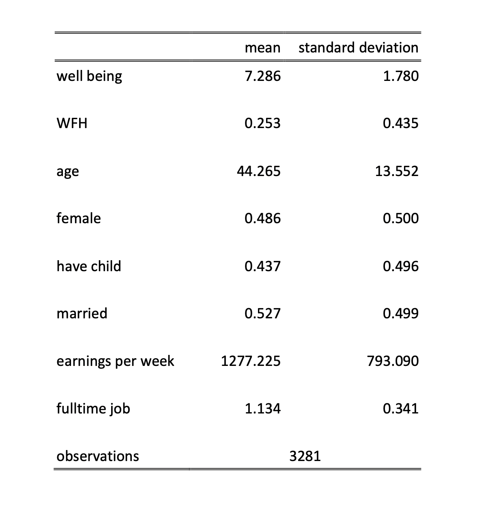
```

## Main Result

```{r}
knitr::include_graphics("main_result.png")
```

## Subgroup: gender

male:

```{r}
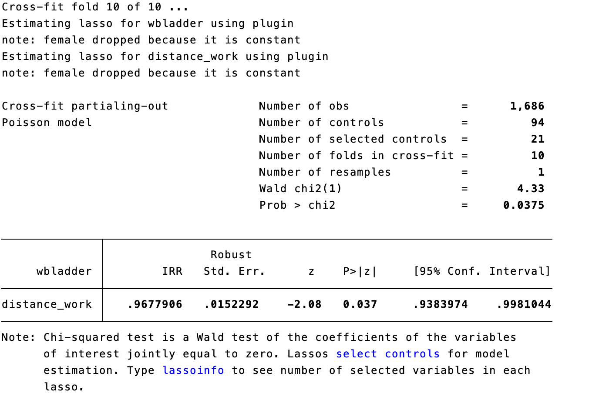
```

## Subgroup: gender

female:

```{r}
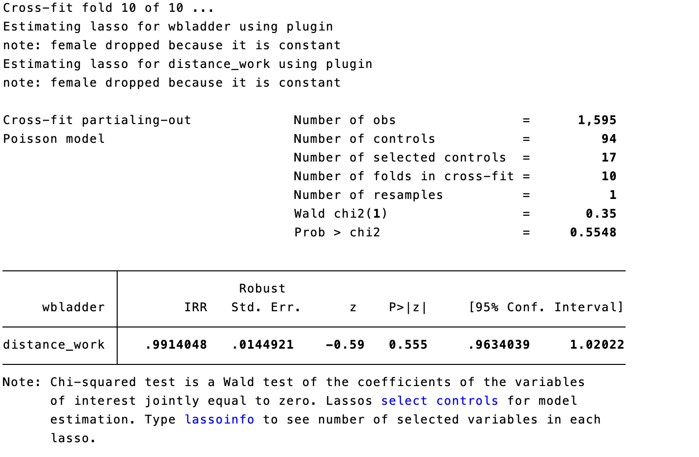
```

## Subgroup: have children or not

have children:

```{r}
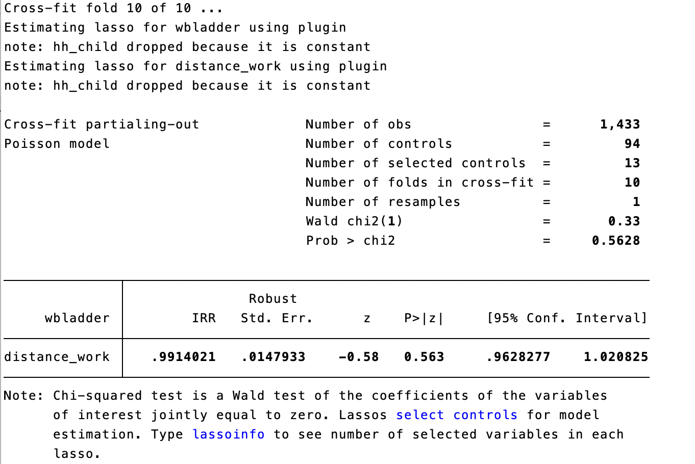
```

## Subgroup: have children or not

do not have any child:

```{r}
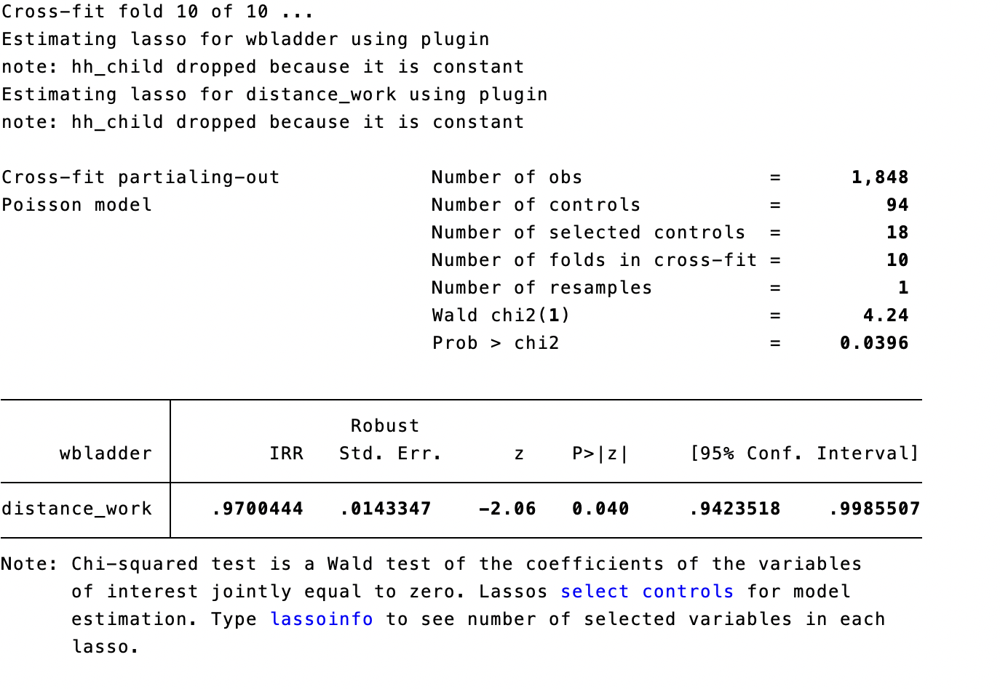
```

## Subgroup: marital status

married:

```{r}
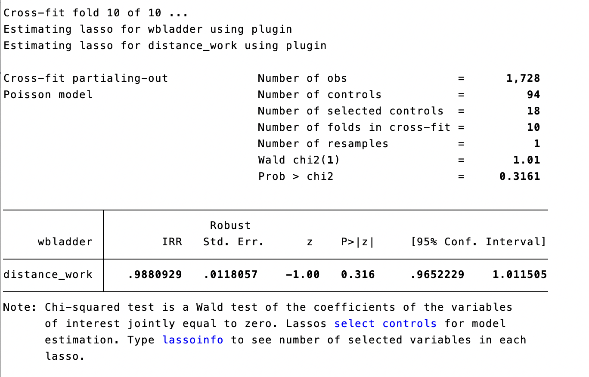
```

## Subgroup: marital status

not married:

```{r}
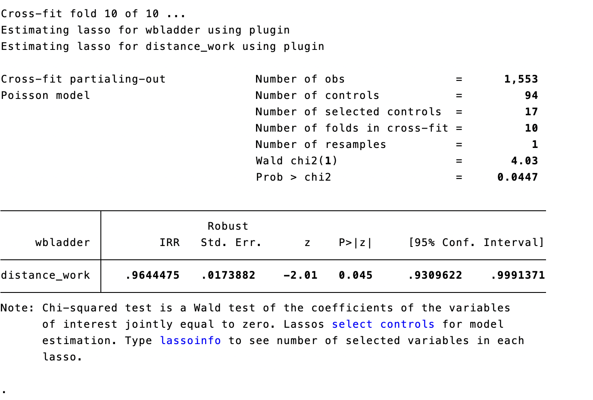
```

## Subgroup: single and married men

single men:

```{r}
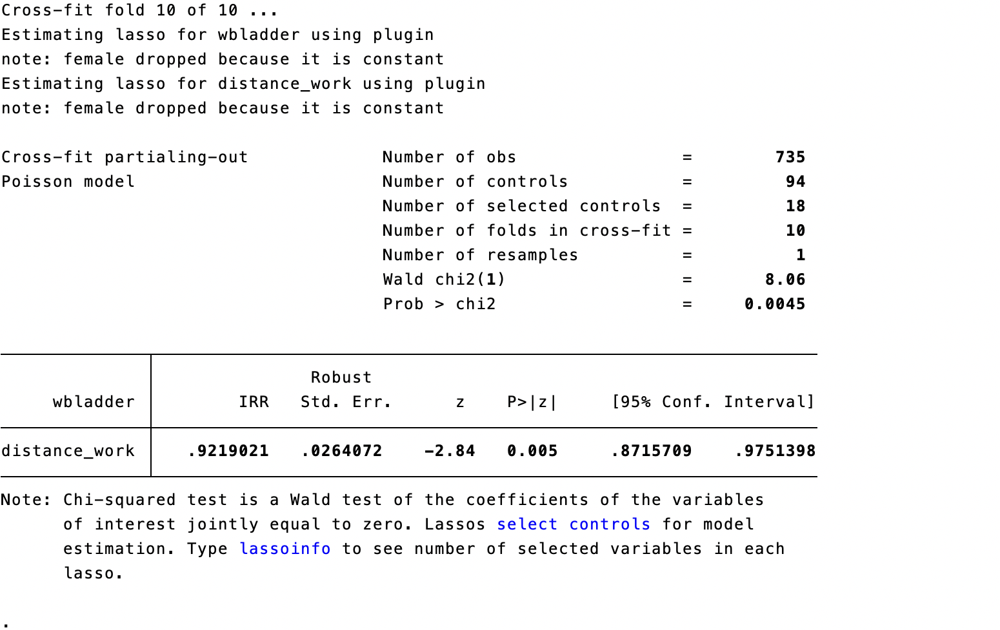
```

## Subgroup: single and married men

married men:

```{r}
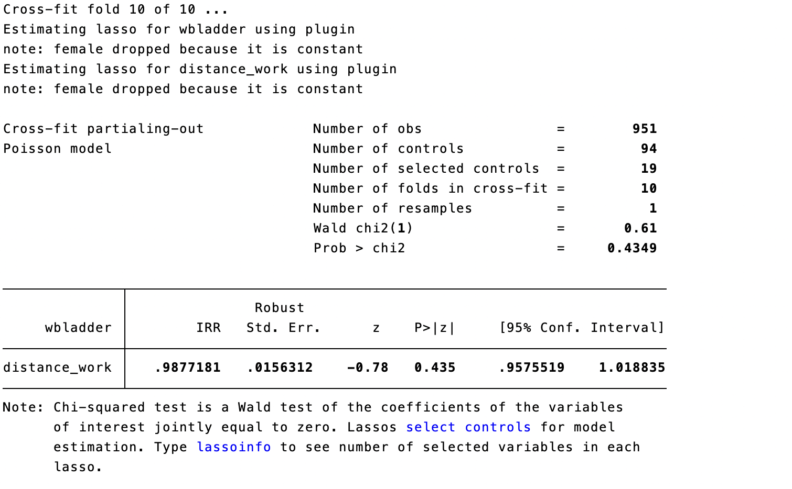
```

## Robustness Check: PSM

```{r}
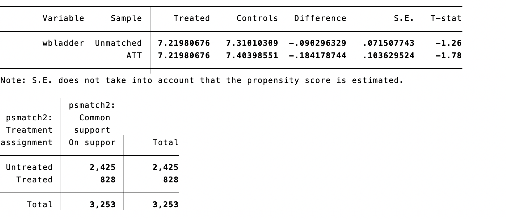
```

## Robustness Check: DML

```{r}
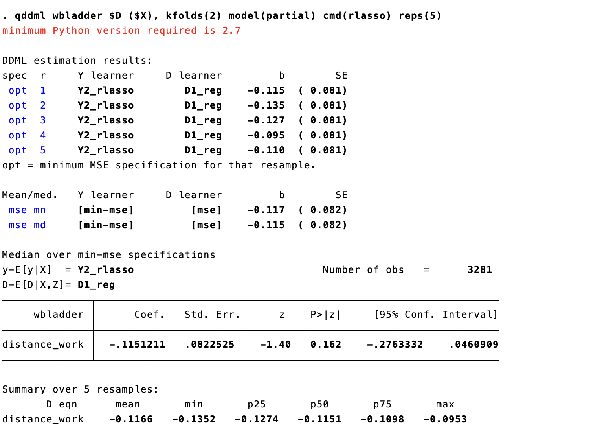
```

## Conclusion

-   Our main finding indicates that working from home slightly decreases workers' well-being by 2.05%, but this decrease is not statistically significant at a 5% significance level. However, it is approaching statistical significance.
-   Working from home has a negative impact on well-being for men, but not for women.
-   Additionally, married individuals reported higher levels of well-being compared to unmarried individuals.
-   Specifically, working from home decreases the well-being of single men by 7.81%.

## Limitation

-   Using survey data may cause some problems. All the data in this study was self-reported.
-   Our sample size is rather small.
