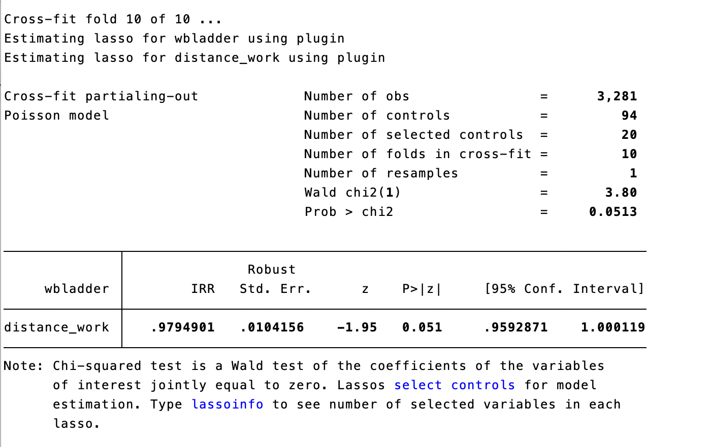

```{r setup, include=FALSE}
knitr::opts_chunk$set(echo = FALSE)
```

## Research Motivation

-   Under the pandemic, there were many inconveniences.
-   We try to figure out how working from home affect workers' well-being.
-   Our assumption is that working from home has negative impact on workers' well-being, since they might feel socially isolated.

## Literature

-   Marco Bertoni,Danilo Cavapozzi et al.\*(2022), "Remote Working and Mental Health During the First Wave of the COVID-19 Pandemic"

## Data Source

IPUMS Time Use 2021

-   $D_i$: Distance working binary variable
-   $Y_i$: Well-being ladder (0-10)
-   $X_i$: Control variables, including statefip, age, gender, have kids, occupation, earning per week, race, fullpart.
-   \# of observations: 3,281, \# of variables: 94

## Assumptions

-   We assume that unconfoundedness is satisfied, which is: $$(Y_{i(0)}, Y_{i(1)})\perp D_i|X_i$$
-   The sparsity assumption holds

# Model

### Poisson regression

Because our $Y$ is a count data, we use poisson regression with double machine learning to specify our treatment effect.

### Recall: Poisson

-   poisson pdf:

    -   If $Y \sim poisson(\lambda)$, then $f(y) = \frac{\lambda^y e^{-\lambda}}{y!}$

-   poisson regression: let $\lambda_i =E(y_i|X_i)= exp(X_i'\beta)$ ,

    -   The conditional pdf is $f(y_i|X_i) = \frac{exp(X_i'\beta)^{y_i} e^{-exp(X_i'\beta)}}{y_i!}$

    -   The log-likelihood is $\ell(\beta|y_i,X_i) = y_i(X_i'\beta) - exp(-X'\beta) - ln(y_i!)$

    -   The poisson regression LASSO criterion is

        $$
        min_{\beta, \gamma} \space Q(\beta,\gamma|X,Y) = -n^{-1} \sum_{i=1}^n \ell(\beta|y_i,X_i) + \gamma \sum_{j=1}^p |\beta_j|
        $$

## XPOPOSSION

Cross-fit partialing-out lasso Poisson regression, the model is:

$$E(y|D,X) = exp(D \alpha + X^T\beta)$$ where

-   $y$ is the dep. variable.

-   $D$ is treatment, which is a scalar.

-   $X$ is the control variable matrix, which is a $n\times p$ matrix.

-   $\beta$ is a $p \times 1$ vector.

## XPOLPR algorithm

### Step 1

Randomly Partition the sample to K folds.

### Step 2

Define two sets:

-   $I_k$: the obs. in fold k

-   $IC_k$: the obs. not in fold k

## XPOLPR algorithm

### Step 3

Run Double Selection poisson lasso For $k = 1, ...,K$

1.  Run poisson lasso for the following model$$
    y = exp(D \alpha_k + X' \beta_k)
    $$and we get the non-zero covariates, denoted by $\tilde X_{k,y}$.

2.  Run poisson regression for the following model$$y = exp(D \alpha_k + \tilde X_{k,y}' \beta_k)$$and we get the estimated coefficients $\tilde\alpha_k$ and $\tilde \delta_k$.

## XPOLPR algorithm

3.  For the obs. $i \in I_k$ , fill in the prediction for the high-dimensional component using the out-of-sample estimate $\tilde \delta_k$.

    $$
    \tilde s_i = \tilde X_{k,y,i}' \tilde \delta_k
    $$

4.  Using the observations $i \in IC_k$, perform a linear lasso of $D$ on $X$ using observation-level weights, $w_i$.

    $$w_i = exp'(D_i \tilde \alpha_k + \tilde s_i)$$

    Denote the selected controls by $\tilde X_{k}$.

## XPOLPR algorithm

5.  Using the observations $i \in IC_k$, fit a linear regression of $D$ on $\tilde X_{k}$, and denote the coefficient estimates by $\hat \gamma_{k}$.

6.  For each observation $i \in I_k$, fill in the instrument

    $$z_i = D_i - \tilde X_{k,i} \hat \gamma_{k}'$$

## XPOLPR algorithm

### Step 4

Compute the point estimates $\hat \alpha$ by solving the following sample-moment equations.

$$
\frac{1}{n} \sum_{i=1}^n \lbrace y_i - exp(D_i \alpha' + \tilde s_i)   \rbrace z_i = 0 
$$

## XPOLPR algorithm

### Step 5

Variance estimation is estimated by

$$
\hat {Var}(\hat \alpha) = n^{-1} \hat J_0^{-1} \hat \Psi (\hat J_0^{-1})'
$$

where
\begin{align*}
&\hat \Psi = K^{-1} \sum_{k=1}^K \hat \Psi_k \\
&\hat \Psi_k = n_k^{-1} \sum_{i \in I_k} \hat\psi_i \hat\psi_i' \\
&\hat\psi_i = \lbrace y_i - exp(d \hat \alpha + \hat s_i) \rbrace z_i \\
&\hat J_0 = K^{-1} \sum_{k=1}^K (n_k^{-1} \sum_{i \in I_k} \hat \psi_i^{\alpha}) \\
&\hat \psi_i^{\alpha} = \frac{\partial \hat \psi_i}{ \partial \hat \alpha}
\end{align*}

# analysis

## Descriptive Statistics

```{r}
knitr::include_graphics("descriptive_statistics.png")
```

## Main Result

```{r}

```

## Subgroup: gender

male:

```{r}
knitr::include_graphics("sub_male.png")
```

## Subgroup: gender

female:

```{r}

```

## Subgroup: have children or not

have children:

```{r}
knitr::include_graphics("sub_havechild.png")
```

## Subgroup: have children or not

do not have any child:

```{r}
knitr::include_graphics("sub_nochild.png")
```

## Subgroup: marital status

married:

```{r}
knitr::include_graphics("sub_married.png")
```

## Subgroup: marital status

not married:

```{r}
knitr::include_graphics("sub_notmarried.png")
```

## Robustness Check: PSM

```{r}
knitr::include_graphics("matching.png")
```

## Robustness Check: DML

```{r}
knitr::include_graphics("ddml.png")
```

## Conclusion

-   It seems that working from home will reduce the distance workers' well-being.
-   We will further examine whether if distance workers' exercise time, sleep time and social time are significantly different to control group.
