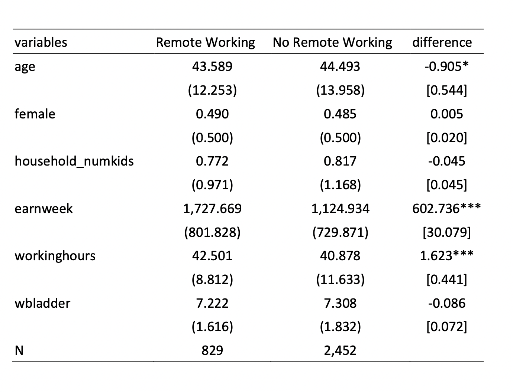
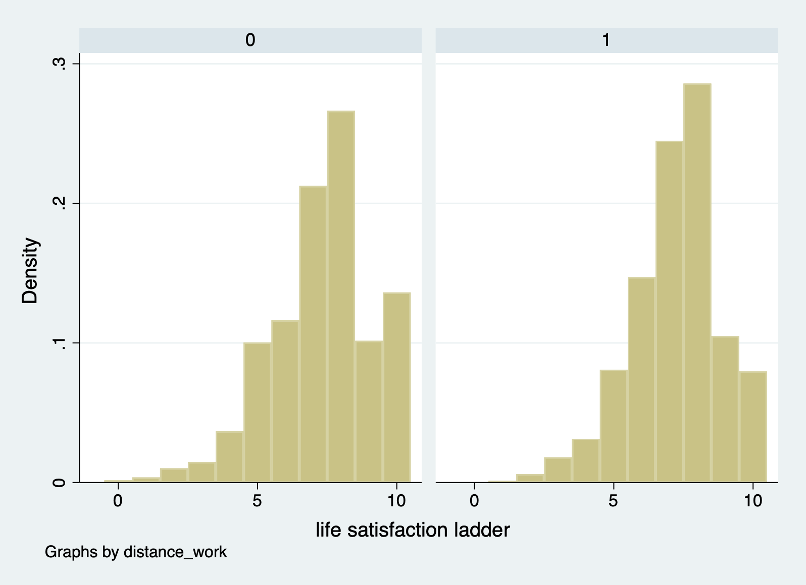
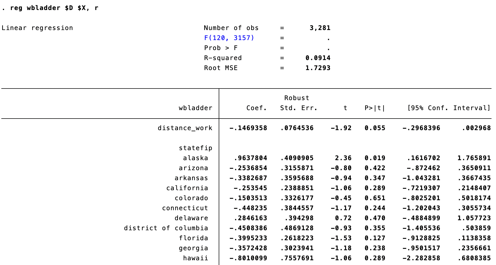
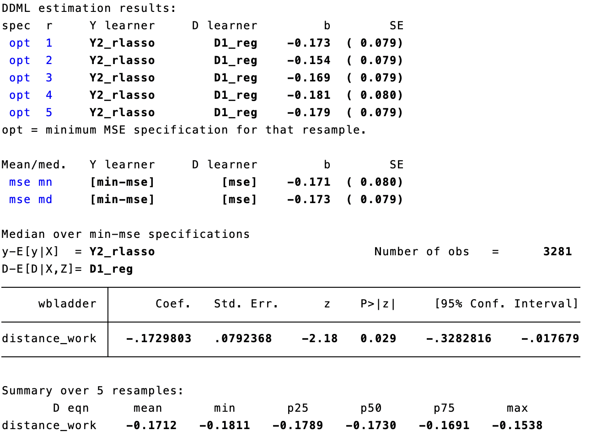

```{r setup, include=FALSE}
knitr::opts_chunk$set(echo = FALSE)
```

## Research Motivation

-   Under the pandemic, there were many inconveniences.
-   We try to figure out how working from home affect workers' well-being.
-   Our assumption is that working from home has negative impact on workers' well-being, since they might feel socially isolated.

## Literature

-   Marco Bertoni,Danilo Cavapozzi et al.\*(2022), "Remote Working and Mental Health During the First Wave of the COVID-19 Pandemic"

## Data Source

IPUMS Time Use 2021

-   $D_i$: Distance working binary variable
-   $Y_i$: Well-being ladder (0-10)
-   $X_i$: Control variables, including statefip, age, gender, have kids, occupation, earning per week, race, fullpart.
-   \# of observations: 3,281, \# of variables: ???

## Assumptions

-   We assume that unconfoundedness is satisfied, which is: $$(Y_{i(0)}, Y_{i(1)})\perp D_i|X_i$$
-   The sparsity assumption holds

# Model

## XPOPOSSION

Cross-fit partialing-out lasso Poisson regression, the model is:

$$E(y|D,X) = exp(D \alpha + X^T\beta)$$ where

-   $y$ is the dep. variable.

-   $D$ is treatment, which is a scalar.

-   $X$ is the control variable matrix, which is a $n\times p$ matrix.

-   $\beta$ is a $p \times 1$ vector.

## XPOLPR algorithm

### Step 1

Randomly Partition the sample to K folds.

### Step 2

Define two sets:

-   $I_k$: the obs. in fold k

-   $IC_k$: the obs. not in fold k

## XPOLPR algorithm

### Step 3

Run Double Selection poisson lasso For $k = 1, ...,K$

1.  Run poisson lasso for the following model$$
    y = exp(D \alpha_k + X' \beta_k)
    $$and we get the non-zero covariates, denoted by $\tilde X_{k,y}$.

2.  Run poisson regression for the following model$$y = exp(D \alpha_k + \tilde X_{k,y}' \beta_k)$$and we get the estimated coefficients $\tilde\alpha_k$ and $\tilde \delta_k$.

## XPOLPR algorithm

3.  For the obs. $i \in I_k$ , fill in the prediction for the high-dimensional component using the out-of-sample estimate $\tilde \delta_k$.

    $$
    \tilde s_i = \tilde X_{k,y,i}' \tilde \delta_k
    $$

4.  Using the observations $i \in IC_k$, perform a linear lasso of $D$ on $X$ using observation-level weights, $w_i$.

    $$w_i = exp'(D_i \tilde \alpha_k + \tilde s_i)$$

5.  

## Run OLS

Consider the following model:

$$Y_i = \tau_{ols} D_{i} + X_{i}^T \boldsymbol{\beta} + \epsilon_{i}, \forall i=1,...,n$$ Where $\tau_{ols}, D_i$ are scalar, $X_i$ is a $k \times 1$ vector, $\boldsymbol{\beta}$ is a $k \times 1$ vector.

## Run DML

Given

$$\xi_0(X_i)=E(Y_i|X_i)$$ $$m_0(X_i)=E(D_i|X_i)=Pr(D_i=1|X_i)$$

We consider the following model: $$Y_i - \xi_0(X_i) = \tau_{dml} (D_i - m_0(X_i)) + u_i$$

-   First, we run Lasso (Y on X) to get $\hat\xi_0(X_i)$ and run Lasso (D on X) to get $\hat m_0(X_i)$
-   Second, we regress $Y_i - \hat\xi_0(X_i)$ on $(D_i - \hat m_0(X_i))$ to get $\hat\tau_{dml}$
-   $\hat\tau_{dml}$ is the treatment effect we want.

# Preliminary analysis

## Descriptive Statistics

```{r}

```

## Graph

```{r}

```

## Estimation Result: OLS

```{r}

```

## Estimation Result: DDML

```{r}

```

## Conclusion

-   It seems that working from home will reduce the distance workers' well-being.
-   We will further examine whether if distance workers' exercise time, sleep time and social time are significantly different to control group.
